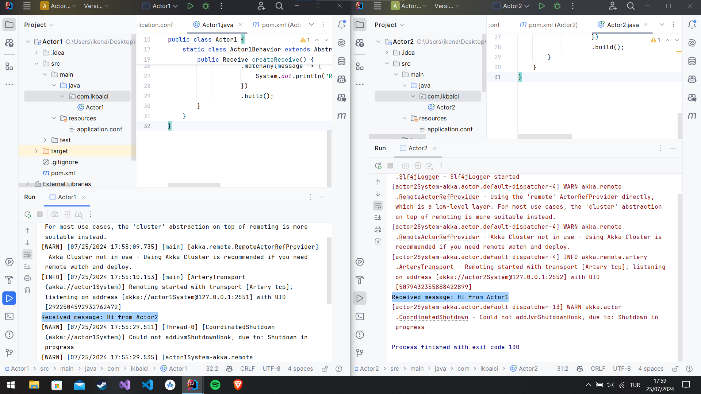

# Akka Actor System Example

This project demonstrates a simple Akka actor system with two actors communicating across different ports. The project is divided into two separate applications, each running on a different port.

## 

